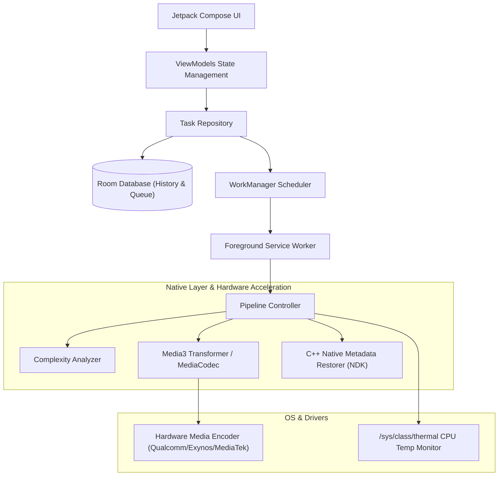

# VCodec — Smart Video Encoder & Compressor for Android

**VCodec (Smart Encoder)** is a high-performance Android utility designed to compress high-bitrate videos (e.g., 4K H.264/HEVC recordings from modern smartphones) into space-saving H.265 (HEVC) files without sacrificing visual quality.

The core differentiator of VCodec is its **hardware-level Constant Rate Factor (CRF) emulation** combined with **absolute metadata preservation** (taken dates, GPS locations, camera model, and proprietary Samsung-specific camera tags) and physical file dates, preventing the "broken" chronological order in the Samsung Gallery when replacing original videos.

---

## ⚙️ Hardware Optimization & Processor Support

The application is deeply optimized for mobile system-on-chip (SoC) media pipelines, leveraging low-level hardware `MediaCodec` APIs. It is optimized to perform at maximum efficiency on the following processor architectures:

### 1. Qualcomm Snapdragon Series
* 🔥 **Snapdragon 8 Gen 1 / Gen 2 / Gen 3** (e.g., Samsung Galaxy S24 Ultra, S23 Ultra, S22 Ultra, OnePlus 12) — Maximum encoding speed, 10-bit HDR10+ support, and hardware-accelerated HEVC/AV1 encoding pipelines.
* ⚡ **Snapdragon 888 / 870 / 865** (e.g., Samsung Galaxy S21 Ultra, S20 FE, OnePlus 9) — Highly balanced HEVC encoding with optimized macroblock processing and thermal efficiency.

### 2. Samsung Exynos Series
* 📱 **Exynos 2400 / 2200 / 2100** (e.g., Samsung Galaxy S24/S24+ and S22/S21 European models) — Optimized for Samsung's proprietary MFC (Multi-Format Codec) hardware engines, ensuring stable 4K HEVC rendering.
* ⚙️ **Exynos 1480 / 1380** (e.g., Samsung Galaxy A55, A54) — Mid-range efficiency profiles designed to balance processing speeds with battery consumption.

### 3. MediaTek Dimensity Series
* ⚡ **Dimensity 9300 / 9200 / 9000** (e.g., Xiaomi 13T Pro, OnePlus Pad) — Advanced hardware media engine optimization to fully utilize multi-core encoding pipelines.

### 🌡️ Thermal Monitoring & Telemetry
Video encoding is a computationally intensive process that puts continuous load on the CPU and GPU. VCodec monitors the system thermal state in real-time by reading `/sys/class/thermal` sensors and displays live telemetry inside the UI (warning colors indicate when the device is heating up). Active encoding is never forcefully throttled or paused by the application itself; instead, the application relies on the OS kernel's native thermal throttling to manage hardware safety, ensuring uninterrupted and predictable background queue progression.

---

## 🌟 Key Features

1. **Smart Bitrate Calculation (CRF Emulation)**:
   Hardware encoders on Android (`MediaCodec`) do not natively support Constant Rate Factor (CRF). VCodec overcomes this by analyzing the input video complexity and calculating a target Variable Bitrate (VBR) before launching the encoder:

   `Target Bitrate = Base Bitrate(Res, FPS) * C_motion * C_noise * C_hdr`

   * **Base Bitrate**: Determined by the source resolution and framerate (e.g., 12 Mbps for 4K 30fps, 3.8 Mbps for 1080p 30fps).
   * **C_motion (Motion Complexity Coefficient)**: Scans structural differences between keyframes (I-frames). Low-motion videos (e.g., interviews, presentations) reduce the bitrate by up to 40%, while high-motion videos (sports, action camera footage) increase it to prevent blockiness and pixelation.
   * **C_noise (Noise & High-Frequency Details)**: Analyzes variance in the high-frequency DCT/FFT domain of selected frames. Increases bitrate in dark, grainy, or complex night scenes to preserve details.
   * **C_hdr (Color Depth Factor)**: Allocates 25% more bitrate for 10-bit HDR (BT.2020) to avoid color banding and gradient artifacts.

2. **Absolute Chronological Integrity (Samsung Gallery)**:
   Standard video compressors reset file dates (`DATE_ADDED`, `DATE_MODIFIED`) to the current time, throwing compressed files to the top of the photo timeline. VCodec implements a **MediaStore Scoped Storage "Delete & Recreate" Strategy**:
   * Reads original `Date Taken` and custom headers from the source MP4 container.
   * Transcodes to a temporary file.
   * Copies all binary headers via native JNI.
   * Completely deletes the original file and registers a new MediaStore entry with the exact original filename and timestamps, keeping your photo library sorted correctly.

3. **Manual Bitrate Selector (Custom Preset)**:
   Allows setting a manual target bitrate (from **0.5 Mbps to 30.0 Mbps**) via a slider on the settings panel.

4. **Streamlined Workflows**:
   * **Pick from Gallery (Direct Flow)**: Set compression settings at the top, select files from the gallery, and they are immediately added to the queue for active background compression, redirecting you straight to the **Queue** tab.
   * **Scan Entire Folder (Interactive Batch)**: Scan a folder, browse the list of files, select specific videos, adjust settings, and add them to the queue manually.

---

## 🛠️ System Architecture

The project follows Clean Architecture guidelines:



---

## 📂 Subscreens & User Interface

The interface features three main tabs:
1. **Scanner**: Configure target settings (Codec, Resolution, Preset, custom bitrate, and Output Mode), scan folder or pick from gallery, and review the interactive files list.
2. **Queue**: Monitor active transcode progress, speed (FPS), and CPU temperature. Manage tasks (pause, resume, delete).
3. **Savings & History**: View total storage saved (in GB) with compression analytics.

---

## 💻 Build & Test Instructions

### Requirements:
* Android Studio (Koala or newer)
* JDK 17
* Android NDK (version 25+) for compiling native C++ metadata restoration libraries.

### Gradle Commands:

* **Compile Debug APK**:
  ```bash
  ./gradlew assembleDebug
  ```
  The output file is generated at `app/build/outputs/apk/debug/app-debug.apk`.

* **Run Unit Tests**:
  ```bash
  ./gradlew testDebugUnitTest
  ```

* **Run Device Integration Tests**:
  ```bash
  ./gradlew connectedAndroidTest
  ```

* **Format Code style (Spotless & ktlint)**:
  ```bash
  ./gradlew spotlessApply
  ```
