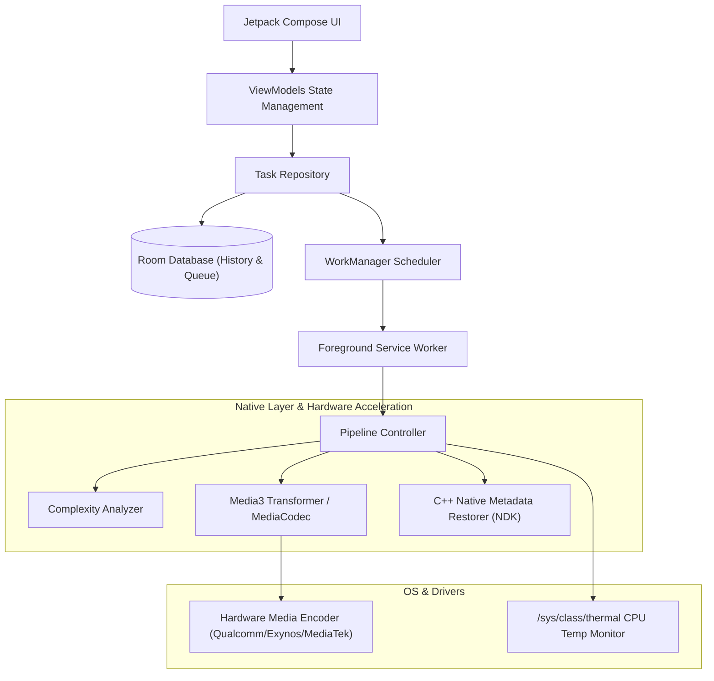

# VCodec — Smart Video Encoder & Compressor for Android

**VCodec (Smart Encoder)** is a high-performance Android utility designed to compress high-bitrate videos (e.g., 4K H.264/HEVC recordings from modern smartphones) into space-saving H.265 (HEVC) files without sacrificing visual quality.

The core differentiator of VCodec is its **hardware-level Constant Rate Factor (CRF) emulation** combined with **absolute metadata preservation** (taken dates, GPS locations, camera model, and proprietary Samsung-specific camera tags) and physical file dates, preventing the "broken" chronological order in the Samsung Gallery when replacing original videos.

---

## ⚙️ Hardware Optimization & Processor Support

The application is deeply optimized for mobile system-on-chip (SoC) media pipelines, leveraging low-level hardware `MediaCodec` APIs. It is optimized to perform at maximum efficiency on the following processor architectures:

### 1. Qualcomm Snapdragon Series
* 🔥 **Snapdragon 8 Gen 1 / Gen 2 / Gen 3** (e.g., Samsung Galaxy S24 Ultra, S23 Ultra, S22 Ultra, OnePlus 12) — Maximum encoding speed, 10-bit HDR10+ support, and hardware-accelerated HEVC/AV1 encoding pipelines.
* ⚡ **Snapdragon 888 / 870 / 865** (e.g., Samsung Galaxy S21 Ultra, S20 FE, OnePlus 9) — Highly balanced HEVC encoding with optimized macroblock processing and thermal efficiency.

### 2. Samsung Exynos Series
* 📱 **Exynos 2400 / 2200 / 2100** (e.g., Samsung Galaxy S24/S24+ and S22/S21 European models) — Optimized for Samsung's proprietary MFC (Multi-Format Codec) hardware engines, ensuring stable 4K HEVC rendering.
* ⚙️ **Exynos 1480 / 1380** (e.g., Samsung Galaxy A55, A54) — Mid-range efficiency profiles designed to balance processing speeds with battery consumption.

### 3. MediaTek Dimensity Series
* ⚡ **Dimensity 9300 / 9200 / 9000** (e.g., Xiaomi 13T Pro, OnePlus Pad) — Advanced hardware media engine optimization to fully utilize multi-core encoding pipelines.

### 🌡️ Thermal Monitoring & Telemetry
Video encoding is a computationally intensive process that puts continuous load on the CPU and GPU. VCodec monitors the system thermal state in real-time by reading `/sys/class/thermal` sensors and displays live temperature telemetry inside the UI. This provides passive diagnostics, helping users monitor hardware heat during intensive queue compression.

---

## 🌟 Key Features

1. **Smart Bitrate Calculation (CRF Emulation)**:
   Hardware encoders on Android (`MediaCodec`) do not natively support Constant Rate Factor (CRF). VCodec overcomes this by analyzing container parameters (resolution, framerate, HDR flags, codec) and calculating an optimal target Variable Bitrate (VBR) before launching the hardware encoder:

   `Target Bitrate = Base Bitrate(Res) * Factor_FPS * Factor_HDR * Discount_Codec`

   * **Base Bitrate**: Baseline for H.265 (12 Mbps for 4K, 4.0 Mbps for 1080p, 2.0 Mbps for 720p).
   * **FPS Factor**: 1.4x for high frame-rate content (> 40 FPS, 60fps/120fps recordings).
   * **HDR Factor**: 1.25x for 10-bit HDR (BT.2020 / HLG / PQ) to avoid color gradient banding.
   * **Codec Discount**: 50% discount for H.264 -> H.265 transcoding, 75% for HEVC recompression.

2. **Absolute Chronological Integrity (2-Phase Transactional Replace)**:
   Standard video compressors reset file dates, throwing compressed files to the top of the gallery timeline. VCodec implements a **Two-Phase Transactional Replace**:
   * Reads original `Date Taken`, `DATE_MODIFIED`, and container-level boxes.
   * Transcodes to a temporary file and verifies data integrity.
   * Restores MP4 metadata and physical filesystem timestamps via native C++ NDK (`futimens`).
   * Writes and verifies the replacement MediaStore entry *before* deleting the original source file.
   * Restores exact MediaStore timestamps upon finalization.

3. **Active Task Controls & Fault Recovery**:
   * Pause, resume, and cancel active video encodings directly from the Queue screen.
   * Automatic recovery resets interrupted tasks to `PENDING` on application restart.

4. **Manual Bitrate Selector (Custom Preset)**:
   Allows setting a manual target bitrate (from **0.5 Mbps to 30.0 Mbps**) via a slider.

5. **Streamlined Workflows**:
   * **Pick from Gallery**: Multi-select videos with real-time size and savings estimation.
   * **Scan Entire Folder (Interactive Batch)**: Scan entire directories, filter by size (> 100 MB) or hide already compressed files.

---

## 🛠️ System Architecture

The project follows Clean Architecture guidelines with modular Jetpack Compose UI:


```mermaid
graph TD
    UI["Jetpack Compose UI"] --> VM["ViewModels State Management"]
    VM --> Repo["Task Repository"]
    Repo --> DB[("Room Database (History & Queue)")]
    Repo --> WM["WorkManager Scheduler"]
    WM --> FGS["Foreground Service Worker"]
    FGS --> Controller["Pipeline Controller"]
    
    subgraph Native Layer & Hardware Acceleration
        Controller --> Analyzer["Complexity Analyzer"]
        Controller --> Transcoder["Media3 Transformer / MediaCodec"]
        Controller --> MetaRestorer["C++ Native Metadata Restorer (NDK)"]
    end
    
    subgraph OS & Drivers
        Transcoder --> HW["Hardware Media Encoder (Qualcomm/Exynos/MediaTek)"]
        Controller --> Sysfs["/sys/class/thermal CPU Temp Monitor"]
    end
```

---

## 📂 Subscreens & User Interface

The interface features three main tabs:
1. **Scanner**: Configure target settings (Codec, Resolution, Preset, custom bitrate, and Output Mode), scan folder or pick from gallery, and review the interactive files list.
2. **Queue**: Monitor active transcode progress, speed (FPS), and CPU temperature. Manage tasks (pause, resume, delete).
3. **Savings & History**: View total storage saved (in GB) with compression analytics.

---

## 💻 Build & Test Instructions

> **Builds are done via GitHub Actions** — every push produces a signed, installable APK
> (artifact on the run page; stable releases also publish a GitHub Release).
> See [docs/09_build_and_deploy.md](docs/09_build_and_deploy.md).

### Requirements:
* Android Studio (Koala or newer)
* JDK 17
* Android NDK (version 25+) for compiling native C++ metadata restoration libraries.

### Gradle Commands:

* **Compile Debug APK**:
  ```bash
  ./gradlew assembleDebug
  ```
  The output file is generated at `app/build/outputs/apk/debug/app-debug.apk`.

* **Run Unit Tests**:
  ```bash
  ./gradlew testDebugUnitTest
  ```

* **Run Device Integration Tests**:
  ```bash
  ./gradlew connectedAndroidTest
  ```

* **Format Code style (Spotless & ktlint)**:
  ```bash
  ./gradlew spotlessApply
  ```
