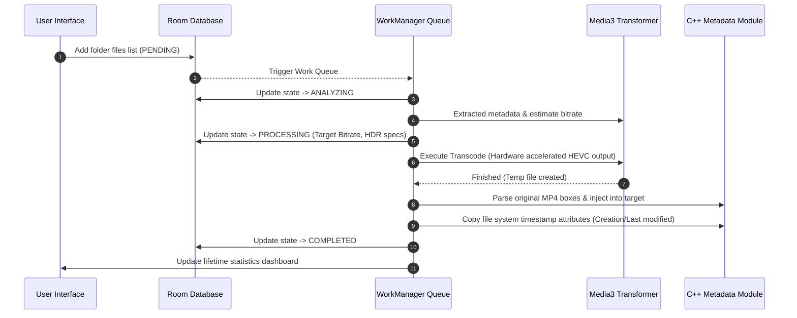

# Specification 01: High-Level Architecture Overview

## 1. Executive Summary
The **Smart Encoder** is a high-performance Android utility designed to compress high-bitrate videos (e.g., 4K H.264/HEVC recordings from modern smartphones) into space-saving H.265 (HEVC) or AV1 files. The core differentiator of this application is its **"Smart Encoding" engine** combined with **absolute metadata preservation** (ensuring file creation dates, GPS tags, and proprietary Samsung camera metadata are not destroyed).

The architecture is deeply optimized for:
* **Samsung Galaxy S24 Ultra** (Snapdragon 8 Gen 3)
* **Samsung Galaxy S21 5G** (Snapdragon 888)

---

## 2. High-Level Architecture Diagram
The application follows a clean-architecture model, dividing the system into distinct presentation, domain, database, background execution, and native media processing layers:

```mermaid
graph TD
    UI[Jetpack Compose UI] --> VM[MVI / MVVM ViewModels]
    VM --> Repo[Task Repository]
    Repo --> DB[(Room Database)]
    Repo --> WM[WorkManager Scheduler]
    WM --> FGS[Foreground Service Worker]
    FGS --> Controller[Pipeline Controller]
    
    subgraph Media Processing Layer
        Controller --> Analyzer[Complexity Analyzer]
        Controller --> Transcoder[Media3 Transformer / MediaCodec]
        Controller --> MetaRestorer[C++ Native Metadata Restorer]
    end
    
    subgraph Operating System & Hardware
        Transcoder --> HW[Snapdragon HEVC/AV1 Hardware Decoders & Encoders]
        Controller --> Sysfs[/sys/class/thermal Monitor]
    end
```

---

## 3. Subsystem Decomposition

### 3.1 Presentation Subsystem (UI & UX)
* **Technology**: Jetpack Compose, Material You (Dynamic System Color Themes matching OneUI).
* **Screens**:
  1. **Scanner Screen**: Scans target directories recursively under Scoped Storage, lists candidates with metadata filters, and queues them.
  2. **Queue Screen**: Manages active and pending transcode items, displaying CPU temp, speed (FPS), progress, and estimates.
  3. **History & Savings Screen**: Tracks historical compression efficiency, total space saved (GB), and task logs.

### 3.2 Queue & State Management Subsystem
* **Task Repository**: Provides a unified data access layer using Room DB and Kotlin Flows.
* **Room DB Schema**: Tracks file URIs, file sizes (original vs compressed), target bitrates, processing status (`PENDING`, `ANALYZING`, `PROCESSING`, `PAUSED`, `COMPLETED`, `FAILED`), and thermal logs.
* **WorkManager Worker**: Executes the processing pipeline as a Foreground Service, ensuring the operating system does not terminate the process during long-running queues.

### 3.3 Smart Encoding & Pre-Analysis Subsystem
* **Analyzer**: Uses `MediaExtractor` to inspect the source file container. Checks if the video is H.264 or HEVC, parses framerate, resolution, and HDR dynamic range formats.
* **Heuristics Engine**: Uses a dynamic mathematical model (predictive bitrate selection) to calculate the target encoding bitrate based on frame complexity, resolution, framerate, and HDR flags.

### 3.4 Media Processing & Native Subsystem
* **Transcoder**: Leverages Android Media3 Transformer API wrapper over low-level hardware `MediaCodec` codecs to read, decode, resize, and encode streams.
* **Metadata Restorer (C++ NDK)**: Accesses the low-level MP4 container header using native C++ file-descriptor streaming. Extracts source user-data (`udta`), metadata (`meta`), and vendor-specific tags, and injects them back into the destination file after transcoding.
* **System Time Restorer**: Uses `java.nio.file` and NDK system time structures to override target file system times (`CreationTime`, `LastModifiedTime`) to match the source file.

---

## 4. End-to-End Data Flow Schema
When a user enqueues a video folder for compression, the data flows as follows:


